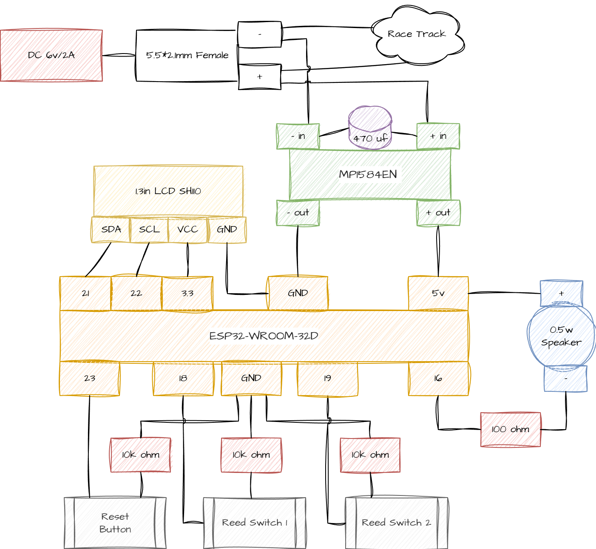

# Summary

The project contains the code for the ESP-32 that power the lap counter.

# Hardware

1. ESP32-WROOM-32D
1. 1.3 Inch I2C IIC OLED Display Module 128X64 Pixel SH110

# Pre-Requisite

1. Adafruit SH110X@2.1.13
1. Adafruit GFX Library@1.12.1
1. Wire
1. Bounce2@2.71.0

# Wiring Details
## Reset Button
- One branch -> 10k ohm -> GND
- One branch -> GPIO 23

## Speaker
- Black -> 100ohm -> GPIO16
- Red -> 5V

## Reed Button 1
- One branch -> 10k ohm - > GND
- One branch -> GPIO 18

## Reed Button 2
- One branch -> 10k ohm - > GND
- One branch -> GPIO 19

## LCD
- GND -> GND
- VCC -> 3.3V
- SDA -> GPIO 21
- SCL -> GPIO 22

## Power
MP1584
- Negative in: Connect to 6v/2a negative and 470 uf capacitor
- Positive in: Connect to 6v/2a positive and 470 uf capacitor
- Negative out: Connect to ESP-32 GND
- Positive out: Connect to ESP-32 5v

Race Track
- Negative from female (direct connection)
- Positive from female (direct connection)

# Full Schematic

